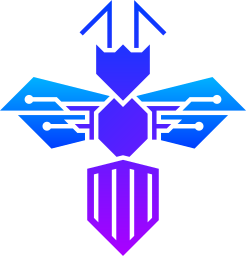

<h1 align="center">
  
   
  <strong>Safenatics</strong>
</h1>

<h4 align="center" style="margin-top: -10px;">
  Protecting Your Digital World with Cutting-Edge Cybersecurity Solutions
</h4>

  
  
  

  <a href="#mission">MISSION</a> •
  <a href="#services">SERVICES</a> •
  <a href="#projects">PROJECTS</a> •
  <a href="#principles">PRINCIPLES</a> •
  <a href="#contact">CONTACTS</a> •
  <a href="#license">LICENSE</a>

## Mission

At *Safenatics*, our mission is to protect your digital assets from emerging threats. We combine expertise in penetration testing, malware analysis, incident response, and security development to offer a comprehensive suite of cybersecurity services.

Our team, born from the competitive world of *Capture The Flag (CTF)* challenges, applies their deep knowledge of hacking, defense, and everything in-between to stay ahead of cybercriminals.

---

## Services

We offer a range of services tailored to safeguard your infrastructure:

- *Penetration Testing*: Simulating cyberattacks to identify vulnerabilities and help you strengthen your defenses.
- *Vulnerability Assessment*: Assessing your infrastructure for potential weaknesses and providing actionable insights.
- *Malware Analysis*: Analyzing and reverse-engineering malware to mitigate future threats.
- *SIEM Solutions*: Offering real-time security alert analysis and monitoring for your infrastructure.
- *Digital Forensics*: Investigating and mitigating security breaches to help you respond to incidents swiftly.
- *Incident Response*: Quickly responding to security breaches with effective recovery strategies.
- *CTF Challenges*: Developing Capture The Flag challenges to assess and improve cybersecurity skills.
- *Development Services*: Secure application and system development, minimizing vulnerabilities from the start.
- *Cyber Assistance*: Expert cybersecurity strategies and tools to protect your business.

---

## Projects

Our team has created some amazing tools and frameworks, including:

- *NLP & Web Fuzzer*: A tool to simulate various inputs (text/URLs) to test the robustness of web apps and NLP systems against edge cases.
- *IDS/Firewall*: Frameworks for real-time threat detection and network traffic filtering to protect your systems from unauthorized access.
- *SIEM Solutions*: Security Information & Event Management systems for monitoring, analyzing, and detecting security threats in real-time.

---

## Principles

Our core principles guide everything we do:

- *Innovation*: Continuously developing new security solutions to stay ahead.
- *Integrity*: Always upholding the highest standards of security.
- *Collaboration*: Working with you to understand and solve your unique challenges.

---

## Contact

Have questions or need assistance? Reach out to us!

- *Website*: [https://www.safenatics.com](https://www.safenatics.com)
- *Instagram*: [Follow us on Instagram](https://www.instagram.com/safenatics/)
- *LinkedIn*: [Connect with us!](https://www.linkedin.com/company/safenatics)
- *Email*: [contactus@safenatics.com](mailto:contactus@safenatics.com)

---
